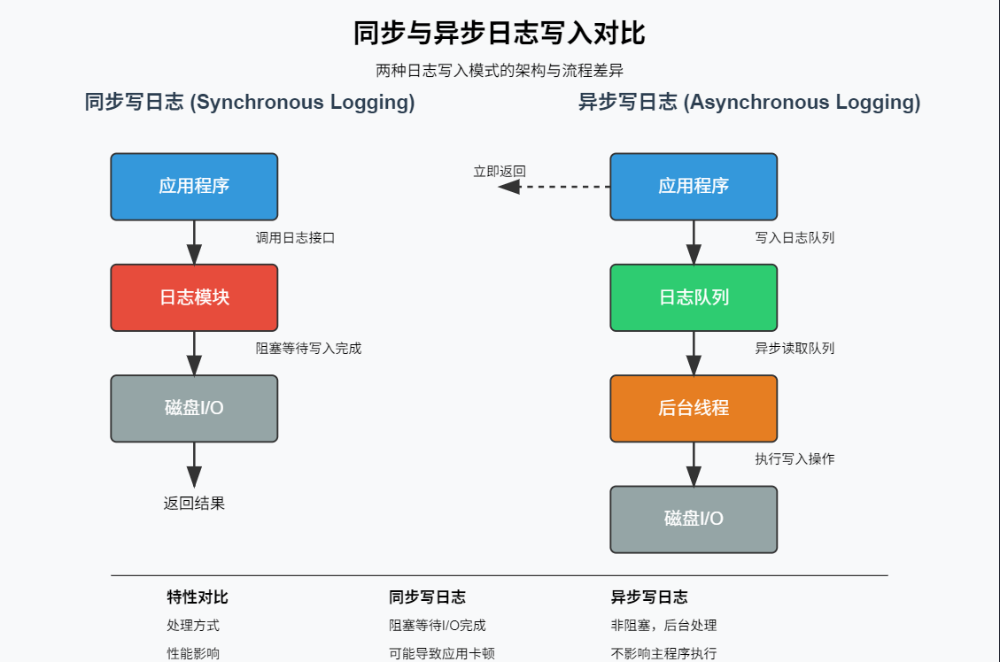

# LoggingSystem

## 项目介绍
* 支持多级日志消息
* ⽀持同步⽇志和异步⽇志
* ⽀持可靠写⼊⽇志到控制台、⽂件以及滚动⽂件中
* ⽀持多线程程序并发写⽇志
* ⽀持扩展不同的⽇志落地⽬标地

## 核心技术
* 类层次设计(继承和多态的应用)
* C++11特性(线程安全、智能指针、auto、右值引用)
* 双缓冲区
* 生产者消费者模型
* 多线程
* 设计模式(单例、工厂、代理、建造者)

## 同步日志与异步日志对比

